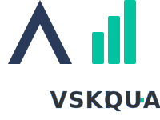

# VSKI·QUANT: Real-time Data Streaming & Aggregation Engine




**VSKI·QUANT** is a high-performance, general-purpose engine for real-time data
ingestion, processing, and aggregation. It is built from the ground up to power
modern applications that require immediate insights from streaming data, making
it an ideal backend for real-time analytics dashboards and machine learning
pipelines.

> **:warning: Disclaimer:** This project is currently in a **pre-alpha** stage
> and is under active development. It is not recommended for any use except
> development or education purposes. APIs and core architecture are subject to
> change.

---

## Core Features

- **High-Throughput Event Ingestion**: A low-latency HTTP API for recording
  events, designed to handle high volumes of data without blocking.
- **Durable & Asynchronous Aggregation**: Events are pushed to a reliable,
  Redis-based queue for asynchronous processing. This ensures the ingestion API
  remains fast and responsive, even under heavy load.
- **Stream & Batch Processing**: Quant seamlessly supports both stream
  processing for real-time insights on fresh data and batch processing for
  historical analysis on fully aggregated data.
- **Flexible Reporting Engine**: Define custom reports and datasets by
  aggregating metrics from various event sources. Query data with flexible time
  ranges, granularities, and attributions.
- **Automatic Time-Series Partitioning**: To maintain high query performance at
  scale, VSKI·QUANT can automatically partition large aggregation collections by
  time.
- **Built-in API Management**: Includes a REST API for creating, updating, and
  managing API keys with configurable quotas and rate limits.
- **Extensible Architecture**: A plugin system allows for extending core
  functionality, such as adding custom aggregation types or triggering external
  actions.

## Use Cases

The core engine is designed to be the data backbone for a variety of
applications:

- **Real-time Analytics Dashboards**: Power live dashboards that visualize user
  activity, business metrics, or system performance as it happens.
- **Machine Learning Pipelines**: Use Quant as a feature store or data source,
  feeding both real-time and historical data into ML models for training and
  inference.
- **Event-Driven Systems**: Act as a central hub for events, triggering webhooks
  or other actions based on complex, aggregated conditions.
- **Usage Metering & Billing**: Track API usage or product feature consumption
  in real-time to power metered billing systems.

## Getting Started

### Prerequisites

- Deno 2.5.3+
- Docker and Docker Compose

### Installation

1. **Clone the repository:**
   ```sh
   git clone git@github.com:vski-ai/quant.git
   cd quant
   ```

2. **Set up environment variables:** Create a `.env` file and add the necessary
   configuration. You can start by copying the example:
   ```sh
   cp .env.example .env
   ```
   Be sure to set a `AUTH_MASTER_KEY` for accessing admin endpoints.

3. **Start dependencies:** Run the included Docker Compose file to start MongoDB
   and Redis.
   ```sh
   docker-compose up -d
   ```

4. **Run the application:** Use the Deno task runner to start the server.
   ```sh
   deno run dev
   ```
   The API will be running on `http://localhost:8000`.

## Architecture Overview

See developer documentation [core/doc/dev.md](core/doc/dev.md)

## Licensing

VSKI·QUANT is source-available under a custom license based on MIT, with
limitations for commercial use.

See the `LICENSE` file for full licensing details.
